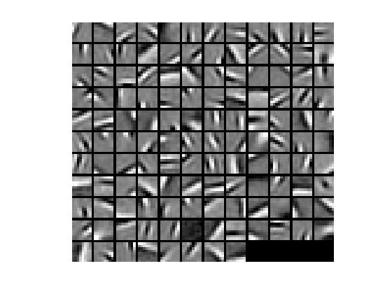
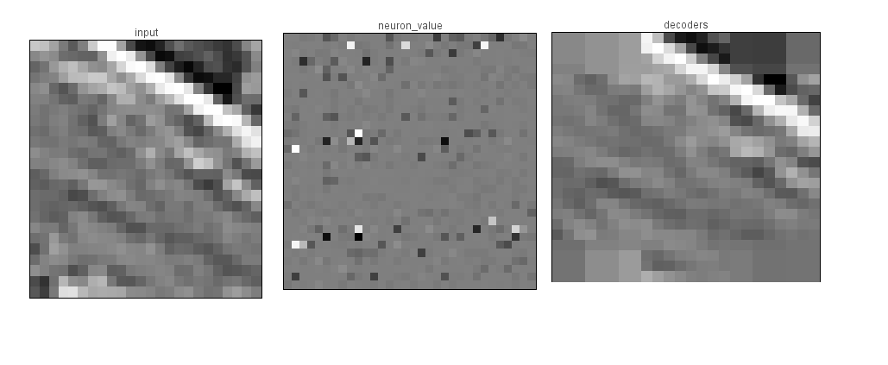
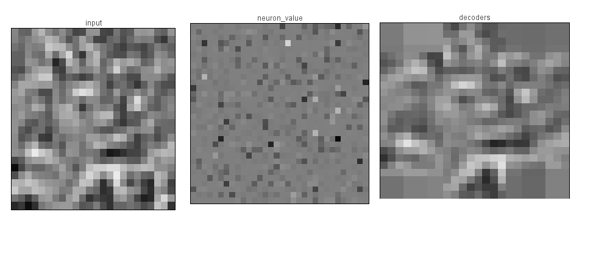
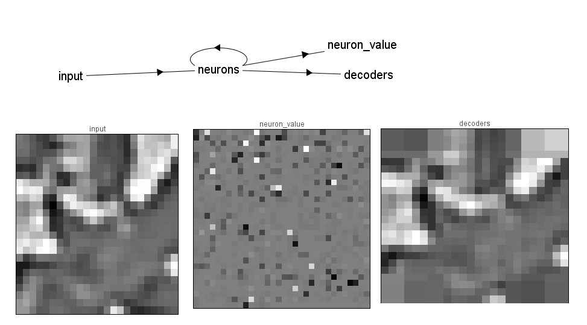
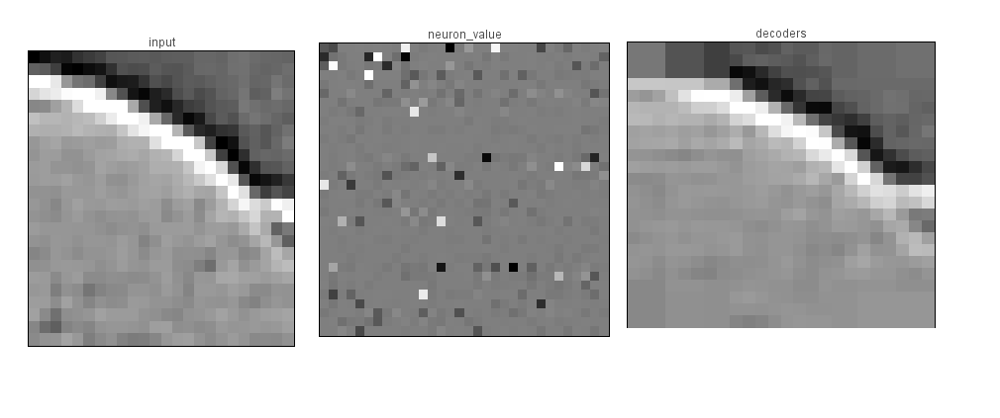
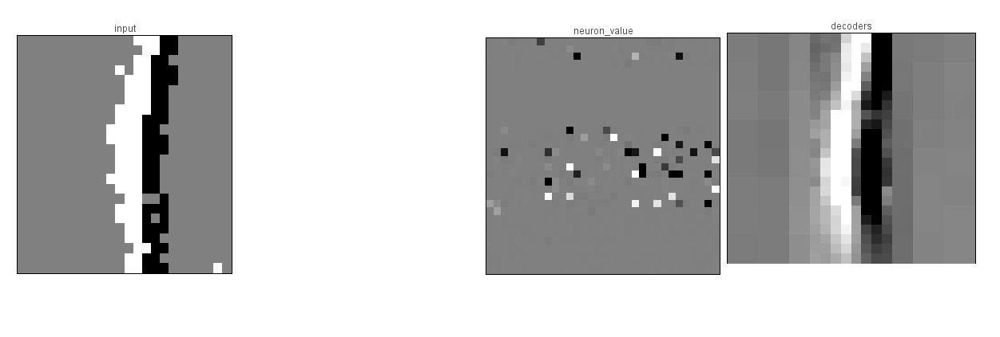

Sparse coding in real-time
==========================

The spike based visual saliency project takes spike events from the
Silicon Retina and ports them into the Neural Engineering Framework
(NEF) in order to identify the visually salient portions of the video
seen by the retina.

Sparse coding and saliency computations are achieved in NEF with
several layers of spiking neurons with strong lateral inhibitions.

Five network files are included in this project.

## Small sparse coding network

The first, `LCA2.py`, is a simple demonstration of the sparse coding
principle. 8x8 image clips are randomly selected from an image library
and input to the network. This image is then projected onto a
population of 128 columns of 100 spiking neurons, each representing a
gabor-like receptive field. Lateral inhibition between the columns
produces a sparse representation. The neural responses are then
projected back into the input space to illustrate the fidelity of the
neural representation.

Receptive Fields used by populations:

The network is connected as follows: given the basis PHI for neural
coding, the connections from the input to the neurons are PHI'. The
lateral connections are -(PHI'PHI-I). Finally, the output of each
neural column passes through a nonlinear function, the soft-threshold,
which reduces noise and enforces sparsity. The resulting differential
equation is: TAU du/dt + u = PHI'y - (PHI'PHI - I) a a = ST(u) where
<y> is the input image, and <a> is the output of the neural
columns. This is the Locally Competitive Algorithm (LCA), see Rozell
et al. 2008. This is guaranteed to converge to an optimally sparse
representation.

## Large sparse coding network

`LCAbig.py` is similar to `LCA2.py`, but accepts 24x24 image clips,
and projects them onto a layer of 1024 columns of 30 neurons each. The
higher resolution allows for features to be discernable to the human
eye. To generate the receptive fields for the 102 neurons, we tiled
the 8x8 receptive fields 7 times around the center, and we added an
expanded receptive field (9 times the size of the original) that
covered the input space with low resolution. Note that this network is
very large, and requires over 1GRAM to be allocated to Nengo! Results
of this experiment can be seen in the following images.

## Large network taking realtime inputs from the silicon retina

In the next experiment, we used events from the silicon retina as
inputs. In order to make this transfer, we had to run jAER. In jAER,
we applied a 48x48 pixel spatial filter on the events received from
the retina, and broadcast these as unimodal UDP signals. We then
opened NENGO and ran the script `LCAbig_UDP.py`, which subsampled the
input into a 24x24 array and input it into the same network as
before. Since events are streaming in real time, the simulator also
has to be able to compute in real time. For this reason, we recommend
a fast computer with a lot of memory. Results can be seen in the
attached sparse_rep images, where a line was moved back and forth
across the retina's field of view.

## Large network calculating orientation based saliency

`LCAsal.py` is similar to `LCAbig.py`, but adds a visual saliency
layer. Neural columns are sorted into channels based on their
orientation, and all the neurons in a channel have mutual lateral
inhibition. This serves to depress orientations that are common, while
orientations that are unique in the input have no competition in their
channel, so their magnitude is preserved, and they appear salient. The
results of this experiment can be seen in salient.jpg. While the
unique orientation is relatively salient, many non-orientation based
info is being passed into the saliency map, and cluttering the
image. Future versions of the code should try to fix this.

## Large network taking realtime inputs from the silicon retina and calculating saliency

`LCAsal_UDP.py` is an attempt to combine the last two
experiments. Unfortunately, the addition of the extra layer slowed
down the network so much that signals had trouble propagating to the
salience layer. This experiment should be repeated on a more powerful
computer.
